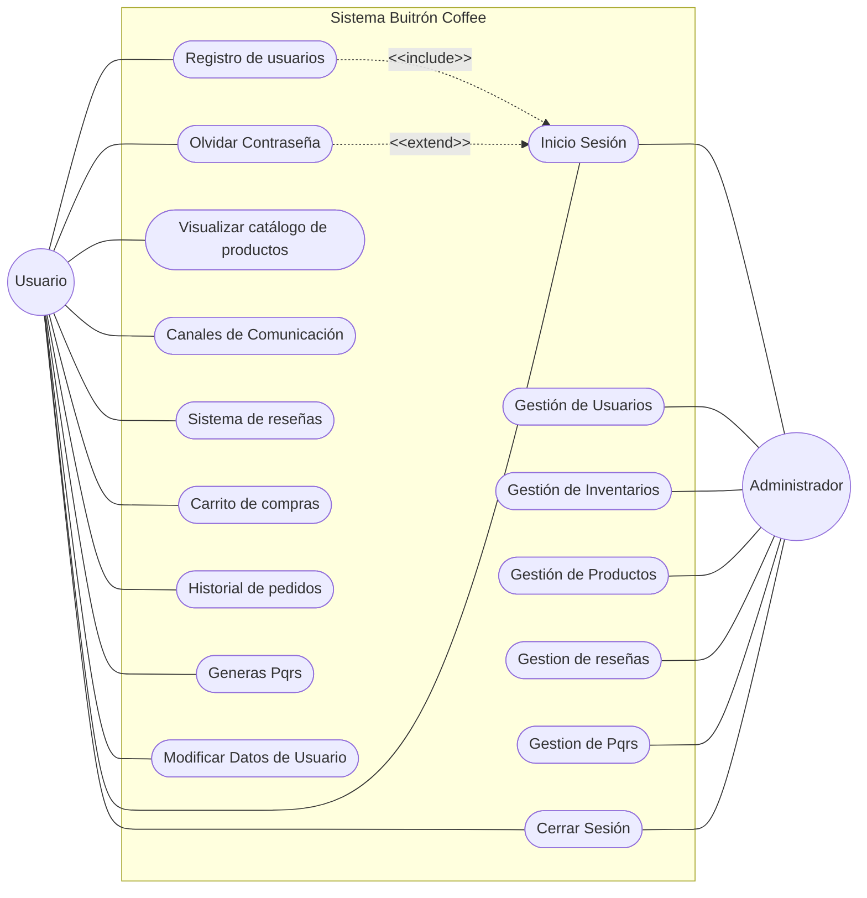
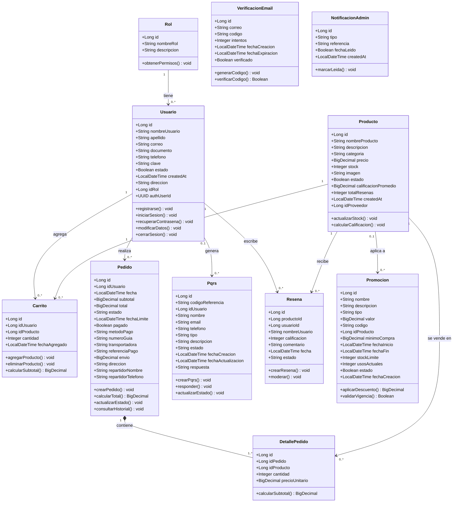
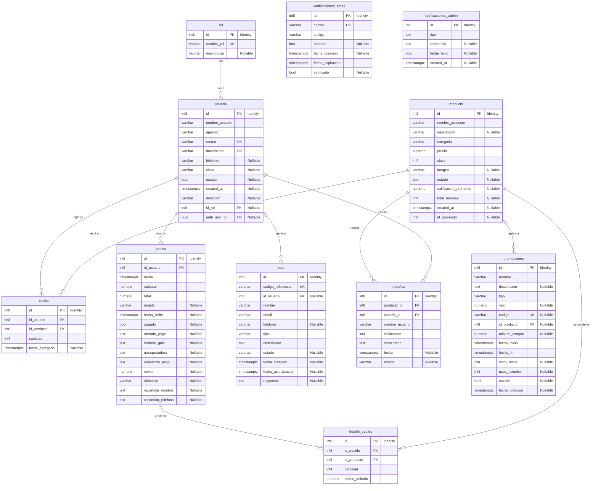
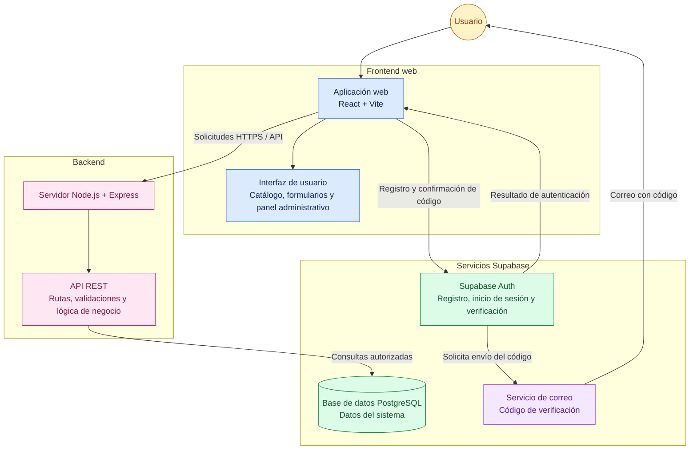

**Sistema:** Buitrón Coffee

# Diagrama de casos de uso

```mermaid
flowchart LR
    %% Actores
    Usuario(("Usuario"))
    Admin(("Administrador"))

    %% Límite del sistema
    subgraph SIS["Sistema Buitrón Coffee"]
        direction TB
        UC1(["Registro de usuarios"])
        UC2(["Inicio Sesión"])
        UC3(["Olvidar Contraseña"])
        UC4(["Visualizar catálogo de productos"])
        UC5(["Canales de Comunicación"])
        UC6(["Sistema de reseñas"])
        UC7(["Carrito de compras"])
        UC8(["Historial de pedidos"])
        UC9(["Generas Pqrs"])
        UC10(["Modificar Datos de Usuario"])
        UC11(["Gestión de Usuarios"])
        UC12(["Gestión de Inventarios"])
        UC13(["Gestión de Productos"])
        UC14(["Gestion de reseñas"])
        UC15(["Gestion de Pqrs"])
        UC16(["Cerrar Sesión"])
    end

    %% Relaciones include / extend
    UC1 -. "#lt;#lt;include#gt;#gt;" .-> UC2
    UC3 -. "#lt;#lt;extend#gt;#gt;" .-> UC2

    %% Usuario
    Usuario --- UC1
    Usuario --- UC2
    Usuario --- UC3
    Usuario --- UC4
    Usuario --- UC5
    Usuario --- UC6
    Usuario --- UC7
    Usuario --- UC8
    Usuario --- UC9
    Usuario --- UC10
    Usuario --- UC16

    %% Administrador
    UC2 --- Admin
    UC11 --- Admin
    UC12 --- Admin
    UC13 --- Admin
    UC14 --- Admin
    UC15 --- Admin
    UC16 --- Admin
```

# 2 DIAGRAMA DE CLASE (Mermaid)

```mermaid
classDiagram
  class Rol {
    +Long id
    +String nombreRol
    +String descripcion
    +obtenerPermisos() void
  }
  class Usuario {
    +Long id
    +String nombreUsuario
    +String apellido
    +String correo
    +String documento
    +String telefono
    +String clave
    +Boolean estado
    +LocalDateTime createdAt
    +String direccion
    +Long idRol
    +UUID authUserId
    +registrarse() void
    +iniciarSesion() void
    +recuperarContrasena() void
    +modificarDatos() void
    +cerrarSesion() void
  }
  class Producto {
    +Long id
    +String nombreProducto
    +String descripcion
    +String categoria
    +BigDecimal precio
    +Integer stock
    +String imagen
    +Boolean estado
    +BigDecimal calificacionPromedio
    +Integer totalResenas
    +LocalDateTime createdAt
    +Long idProveedor
    +actualizarStock() void
    +calcularCalificacion() void
  }
  class Carrito {
    +Long id
    +Long idUsuario
    +Long idProducto
    +Integer cantidad
    +LocalDateTime fechaAgregado
    +agregarProducto() void
    +eliminarProducto() void
    +calcularSubtotal() BigDecimal
  }
  class Pedido {
    +Long id
    +Long idUsuario
    +LocalDateTime fecha
    +BigDecimal subtotal
    +BigDecimal total
    +String estado
    +LocalDateTime fechaLimite
    +Boolean pagado
    +String metodoPago
    +String numeroGuia
    +String transportadora
    +String referenciaPago
    +BigDecimal envio
    +String direccion
    +String repartidorNombre
    +String repartidorTelefono
    +crearPedido() void
    +calcularTotal() BigDecimal
    +actualizarEstado() void
    +consultarHistorial() void
  }
  class DetallePedido {
    +Long id
    +Long idPedido
    +Long idProducto
    +Integer cantidad
    +BigDecimal precioUnitario
    +calcularSubtotal() BigDecimal
  }
  class Pqrs {
    +Long id
    +String codigoReferencia
    +Long idUsuario
    +String nombre
    +String email
    +String telefono
    +String tipo
    +String descripcion
    +String estado
    +LocalDateTime fechaCreacion
    +LocalDateTime fechaActualizacion
    +String respuesta
    +crearPqrs() void
    +responder() void
    +actualizarEstado() void
  }
  class Resena {
    +Long id
    +Long productoId
    +Long usuarioId
    +String nombreUsuario
    +Integer calificacion
    +String comentario
    +LocalDateTime fecha
    +String estado
    +crearResena() void
    +moderar() void
  }
  class VerificacionEmail {
    +Long id
    +String correo
    +String codigo
    +Integer intentos
    +LocalDateTime fechaCreacion
    +LocalDateTime fechaExpiracion
    +Boolean verificado
    +generarCodigo() void
    +verificarCodigo() Boolean
  }
  class NotificacionAdmin {
    +Long id
    +String tipo
    +String referencia
    +Boolean fechaLeido
    +LocalDateTime createdAt
    +marcarLeida() void
  }
  class Promocion {
    +Long id
    +String nombre
    +String descripcion
    +String tipo
    +BigDecimal valor
    +String codigo
    +Long idProducto
    +BigDecimal minimoCompra
    +LocalDateTime fechaInicio
    +LocalDateTime fechaFin
    +Integer stockLimite
    +Integer usosActuales
    +Boolean estado
    +LocalDateTime fechaCreacion
    +aplicarDescuento() BigDecimal
    +validarVigencia() Boolean
  }
  Rol "1" --> "0..*" Usuario : tiene
  Usuario "1" --> "0..*" Carrito : agrega
  Producto "1" --> "0..*" Carrito : esta en
  Usuario "1" --> "0..*" Pedido : realiza
  Pedido "1" *-- "1..*" DetallePedido : contiene
  Producto "1" --> "0..*" DetallePedido : se vende en
  Usuario "0..1" --> "0..*" Pqrs : genera
  Usuario "1" --> "0..*" Resena : escribe
  Producto "1" --> "0..*" Resena : recibe
  Producto "0..1" --> "0..*" Promocion : aplica a
```

# 3. DIAGRAMA ENTIDAD-RELACIÓN (Mermaid)

```mermaid
erDiagram
    rol ||--o{ usuario : "tiene"
    usuario ||--o{ carrito : "agrega"
    producto ||--o{ carrito : "está en"
    usuario ||--o{ pedido : "realiza"
    pedido ||--|{ detalle_pedido : "contiene"
    producto ||--o{ detalle_pedido : "se vende en"
    usuario |o--o{ pqrs : "genera"
    producto ||--o{ "reseñas" : "recibe"
    usuario ||--o{ "reseñas" : "escribe"
    producto |o--o{ promociones : "aplica a"

    usuario {
        int8 id PK "Identity"
        varchar nombre_usuario
        varchar apellido
        varchar correo UK
        varchar documento UK
        varchar telefono "Nullable"
        varchar clave "Nullable"
        bool estado "Nullable"
        timestamptz created_at "Nullable"
        varchar direccion "Nullable"
        int8 id_rol FK "Nullable"
        uuid auth_user_id UK "Nullable"
    }

    producto {
        int8 id PK "Identity"
        varchar nombre_producto
        varchar descripcion "Nullable"
        varchar categoria
        numeric precio
        int4 stock
        varchar imagen "Nullable"
        bool estado "Nullable"
        numeric calificacion_promedio "Nullable"
        int4 total_resenas "Nullable"
        timestamptz created_at "Nullable"
        int8 id_proveedor "Nullable"
    }

    carrito {
        int8 id PK "Identity"
        int8 id_usuario FK
        int8 id_producto FK
        int4 cantidad
        timestamptz fecha_agregado "Nullable"
    }

    pedido {
        int8 id PK "Identity"
        int8 id_usuario FK
        timestamptz fecha
        numeric subtotal
        numeric total
        varchar estado "Nullable"
        timestamptz fecha_limite "Nullable"
        bool pagado "Nullable"
        text metodo_pago "Nullable"
        text numero_guia "Nullable"
        text transportadora "Nullable"
        text referencia_pago "Nullable"
        numeric envio "Nullable"
        varchar direccion "Nullable"
        text repartidor_nombre "Nullable"
        text repartidor_telefono "Nullable"
    }

    detalle_pedido {
        int8 id PK "Identity"
        int8 id_pedido FK
        int8 id_producto FK
        int4 cantidad
        numeric precio_unitario
    }

    pqrs {
        int8 id PK "Identity"
        varchar codigo_referencia UK
        int8 id_usuario FK "Nullable"
        varchar nombre
        varchar email
        varchar telefono "Nullable"
        varchar tipo
        text descripcion
        varchar estado "Nullable"
        timestamptz fecha_creacion "Nullable"
        timestamptz fecha_actualizacion "Nullable"
        text respuesta "Nullable"
    }

    "reseñas" {
        int8 id PK "Identity"
        int8 producto_id FK
        int8 usuario_id FK
        varchar nombre_usuario
        int4 calificacion
        text comentario
        timestamptz fecha "Nullable"
        varchar estado "Nullable"
    }

    verificaciones_email {
        int8 id PK "Identity"
        varchar correo UK
        varchar codigo
        int4 intentos "Nullable"
        timestamptz fecha_creacion "Nullable"
        timestamptz fecha_expiracion
        bool verificado "Nullable"
    }

    rol {
        int8 id PK "Identity"
        varchar nombre_rol UK
        varchar descripcion "Nullable"
    }

    notificaciones_admin {
        int8 id PK "Identity"
        text tipo
        text referencia "Nullable"
        bool fecha_leido "Nullable"
        timestamptz created_at "Nullable"
    }

    promociones {
        int8 id PK "Identity"
        varchar nombre
        text descripcion "Nullable"
        varchar tipo
        numeric valor "Nullable"
        varchar codigo UK "Nullable"
        int8 id_producto FK "Nullable"
        numeric minimo_compra "Nullable"
        timestamptz fecha_inicio
        timestamptz fecha_fin
        int4 stock_limite "Nullable"
        int4 usos_actuales "Nullable"
        bool estado "Nullable"
        timestamptz fecha_creacion "Nullable"
    }
```

# 4. DIAGRAMA DE ARQUITECTURA GENERAL (Mermaid)

```mermaid
flowchart TB
    %% Usuario
    U(("Usuario"))

    %% Frontend
    subgraph FRONT["Frontend web"]
        direction TB
        R["Aplicación web<br/>React + Vite"]
        UI["Interfaz de usuario<br/>Catálogo, formularios y panel administrativo"]
        R --> UI
    end

    %% Backend
    subgraph BACK["Backend"]
        direction TB
        N["Servidor Node.js + Express"]
        API["API REST<br/>Rutas, validaciones y lógica de negocio"]
        N --> API
    end

    %% Servicios Supabase
    subgraph SUPA["Servicios Supabase"]
        direction TB
        AUTH["Supabase Auth<br/>Registro, inicio de sesión y verificación"]
        DB[("Base de datos PostgreSQL<br/>Datos del sistema")]
        MAIL["Servicio de correo<br/>Código de verificación"]
    end

    %% Relaciones
    U --> R
    R -->|"Solicitudes HTTPS / API"| N
    API -->|"Consultas autorizadas"| DB
    R -->|"Registro y confirmación de código"| AUTH
    AUTH -->|"Solicita envío del código"| MAIL
    MAIL -->|"Correo con código"| U
    AUTH -->|"Resultado de autenticación"| R

    %% Estilos
    classDef frontend fill:#DCEAFE,stroke:#2563EB,color:#172554
    classDef backend fill:#FCE7F3,stroke:#BE185D,color:#831843
    classDef supabase fill:#DCFCE7,stroke:#15803D,color:#14532D
    classDef correo fill:#F3E8FF,stroke:#9333EA,color:#581C87
    classDef actor fill:#FEF3C7,stroke:#B45309,color:#78350F

    class R,UI frontend
    class N,API backend
    class AUTH,DB supabase
    class MAIL correo
    class U actor
```
